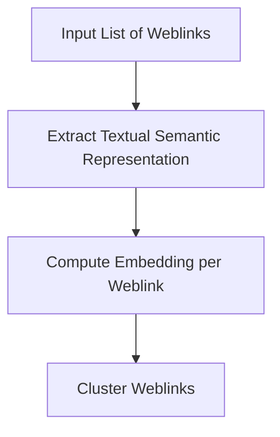
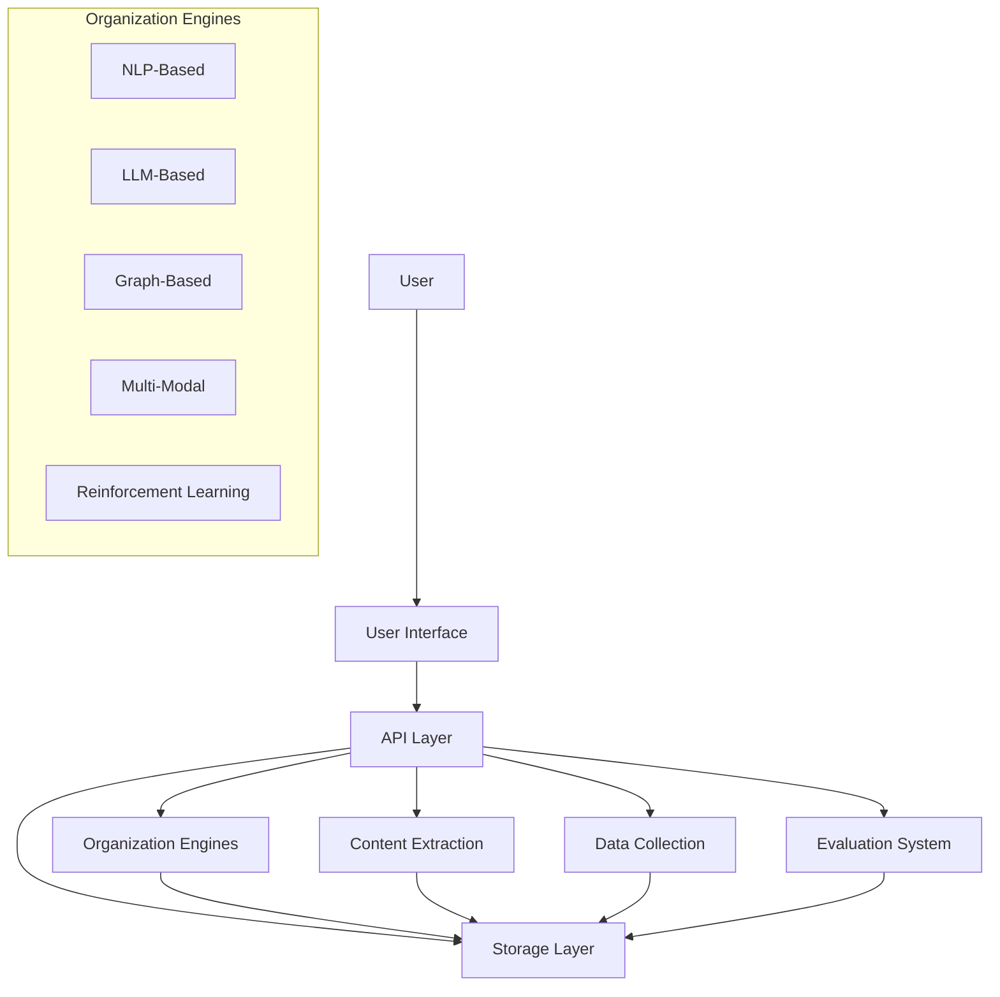
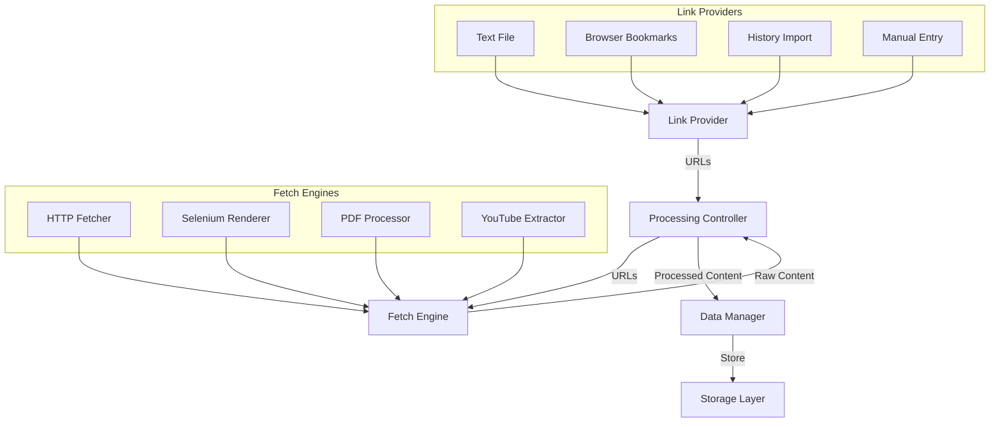
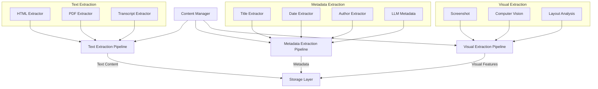
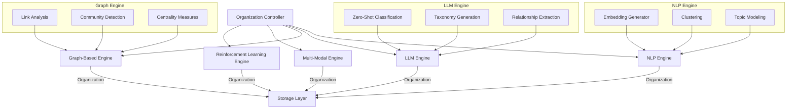
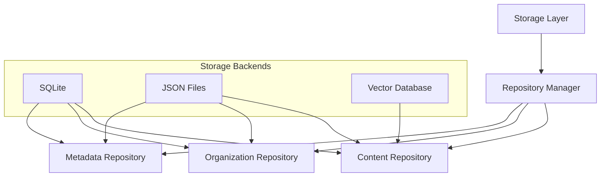
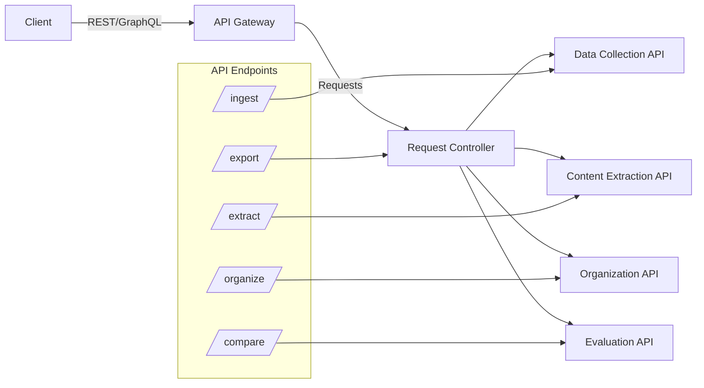
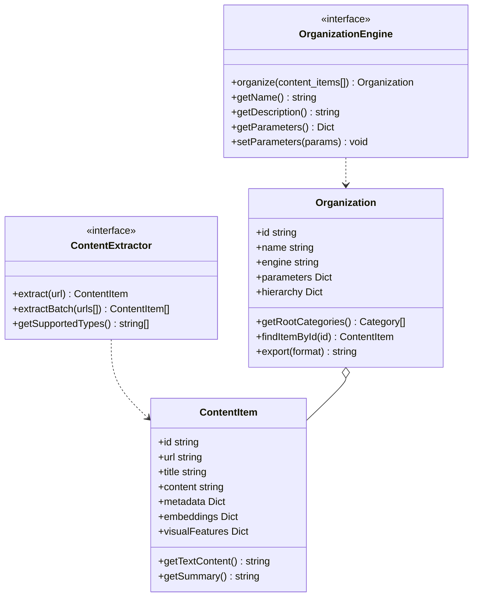

# cluster-links

## A Web-Link Clustering Pipeline

This project is a robust, configurable pipeline for extracting, cleaning, embedding, and clustering web links based on their topical content. It aims to help you automatically organize large collections of URLs (such as bookmarks or research links) into semantically meaningful groups.



### Flow

#### High-Level Architecture Diagram


#### Detailed Subsystem Architecture

##### Data Collection Subsystem


##### Content Extraction Subsystem


##### Organization Engines Subsystem


##### Storage


##### API


#### Component Interfaces


## Key Features

- **Configurable Input:**  
  Reads URLs from a specified file (via `config.json`) and supports domain-based rate limiting and ignore lists (e.g., skip YouTube or problematic PDFs).

- **Robust Content Extraction:**  
  Uses [trafilatura](https://github.com/adbar/trafilatura) to extract the main content from HTML pages (with fallback to BeautifulSoup) and [pdfminer.six](https://github.com/pdfminer/pdfminer.six) to extract text from PDFs (limited to the first 10 pages).  
  Advanced cleaning routines remove common boilerplate and extraneous text.

- **Parallel Processing & Logging:**  
  Extracts text from URLs in parallel using Python’s ThreadPoolExecutor with progress indication. Detailed logs are maintained in separate log files for general extraction, failures, and summary statistics.

- **Embedding & Clustering:**  
  Computes text embeddings with [SentenceTransformers](https://www.sbert.net/) and clusters the links using HDBSCAN and hierarchical clustering methods.

- **Semantic Keyword Extraction:**  
  Generates cluster reports using [KeyBERT](https://github.com/MaartenGr/KeyBERT) to extract meaningful keywords that summarize each cluster’s content.

## How It Works

1. **Read and Clean URLs:**  
   URLs are read from a links file (specified in `config.json`), cleaned, and filtered using `get_links.py`.

2. **Parallel Extraction:**  
   The pipeline fetches each URL, extracts the main content using advanced extraction (with trafilatura and cleaning functions), and logs successes and failures.

3. **Compute Embeddings:**  
   Extracted texts are converted into semantic embeddings using SentenceTransformers.

4. **Clustering & Reporting:**  
   Embeddings are clustered using HDBSCAN (and optionally hierarchical clustering), and a detailed cluster report (with semantic keywords) is generated.

## Getting Started

### Prerequisites

Make sure you have Python 3.8+ installed. Then install dependencies:

```bash
pip install -r requirements.txt
```

### Running the Pipeline


#### Configure the Project

Edit config.json to set your links file (a text file listing weblinks), rate limiting domains, and ignore domains.

#### Run the Project

```bash
python main.py
```

#### View Outputs

**Cluster Report**: See `cluster_report.txt` for grouped links and extracted keywords.

**Logs**: Review `extraction.log`, `extraction_failures.log`, and `extraction_stats.log` for detailed processing information.
